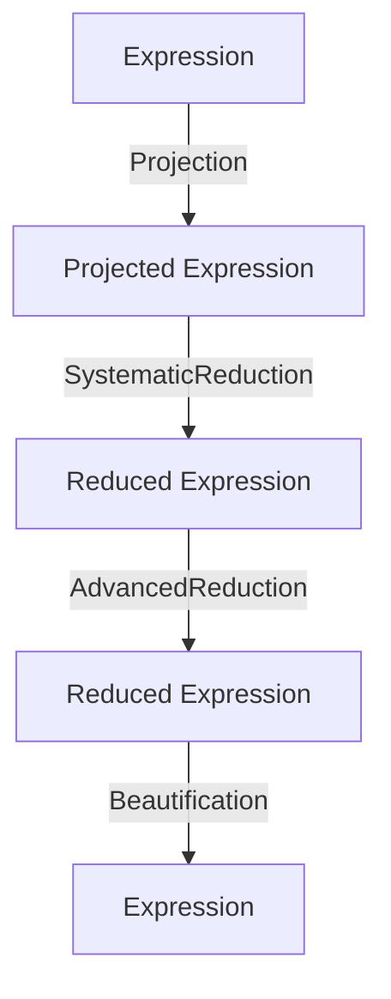
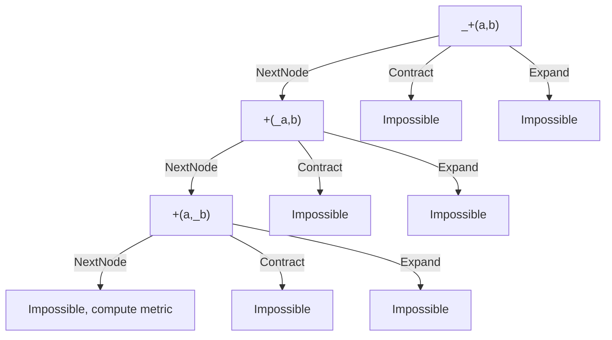
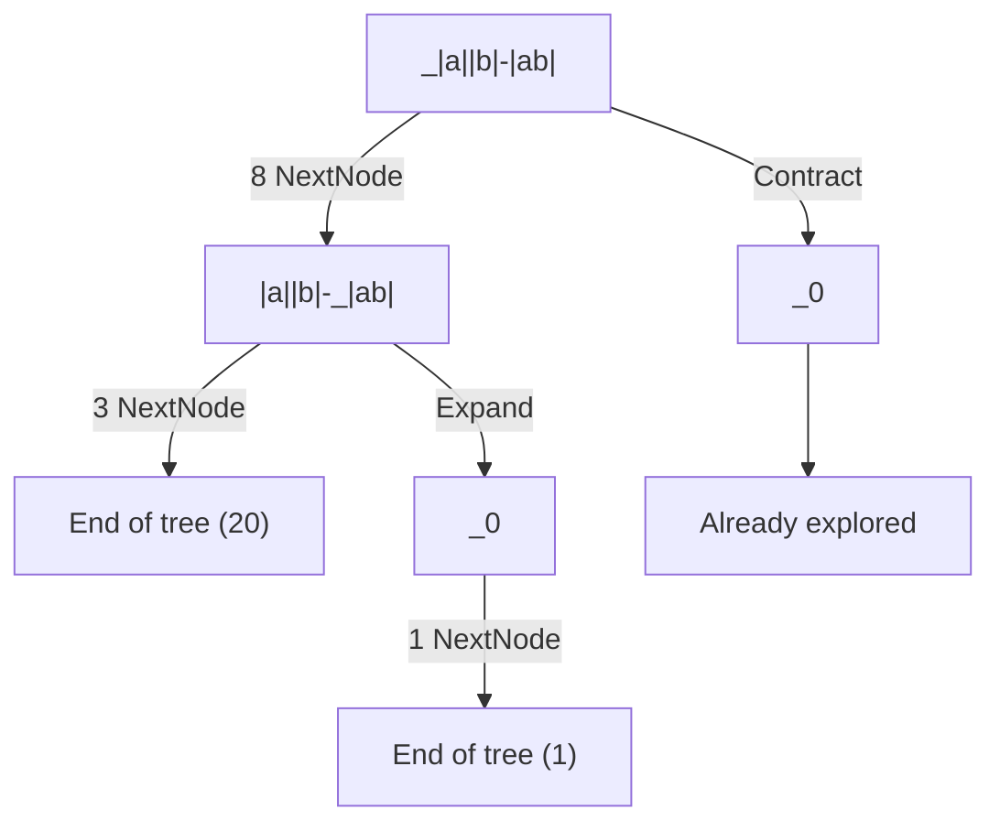

# Simplification algorithm

## Generalities

Starting from any expression, the simplification algorithm finds a better and reduced mathematically equivalent expression.

Steps can be summarized to this:



Steps:
- Projection removes complexMode, angleUnit, ...
- SystematicReduction applies obvious reductions
- AdvancedReduction finds the best reduced representation
- Beautification undoes Projection and apply readability improvements
- In practice, Beautification also prepare for Layouter

Expression properties:
- Projected Expressions are made of specific Nodes
- Projected Expressions are independent from ComplexMode, AngleUnit, ...
- Reduced Expressions are Projected Expressions

These operations never need to be applied twice.


## Detailed steps

- [Seed the random nodes](#random-nodes-seeding)
- [Replace local symbols with variables](#local-symbols)
- [Replace symbols and functions stored in context](#global-symbols)
- [Ensure the expression has a valid dimension](#dimension-check)
- [Extract units and adjust the approximation strategy](#extract-units)
- [Project the expression, approximate depending on the strategy](#projection)
- [Apply systematic reduction](#systematic-reduction)
- [Bubble up lists, applying systematic reduction](#list-bubble-up)
- [Apply advanced reduction](#advanced-Reduction)
- [Simplify Dependencies](#simplify-dependencies)
- [Approximate again, depending on the strategy](#final-approximation)
- [Beautify expression](#beautification)

## Random nodes seeding

Since the next steps may duplicate parts of the expression, we need to seed each random node because a duplicated random node should evaluate to the same random number.

For example, with this projection, both random should always approximate to the same value.
$$sinh(random())=\frac{e^{random()}-e^{-random()}}{2}$$

Therefore, we seed each random in this step with an id. On approximation, random nodes with a same id will be approximated to the same value.

## Local symbols

Local symbols are projected to an id, based on how nested they are in the local contexts, using de Bruijn indexes. Global symbols are preserved.

Below the example expression are written the projected id of the local user symbols.

```
a + diff(c + x + sum(k + a + x, k, 1, x), x, b) + diff(a, a, a)
a        c   0       0   a   1  k  1  0   x  b         0  a  a
```

The second child (e.g. "k" in the sum above) is kept unaltered and will be used to restore the name during the beautification.

When nested inside a parametered expression, all id are incremented. In the parametered expression, `0` is the local parameter.

This variable id has to be accounted for when comparing trees, or manipulating them in and out of parametric expressions, using `Variables::LeaveScope` and `Variables::EnterScope` (move the variable out and in the parametric expression and increment/decrement the id).

## Global symbols

User symbols and functions stored in the given context are replaced with their definition (see `SymbolicComputation` enum for replacement rules), even if nested.

If allowed by `SymbolicComputation`, symbols with no definition are left unchanged.

If anything has been replaced, reapply previous step to seed new random nodes.

For example if $f(x)=x+x+random()$, the expression $f(random())*f(0)$ has been:
- Seeded to $f(random_1())*f(0)$
- Replaced to $(random_1()+random_1()+random())*(0+0+random())$,
- Seeded again to $(random_1()+random_1()+random_2())*(0+0+random_3())$

### Global variable's properties

During our simplification algorithms, the global user symbols and functions are considered to be scalar.

This allows for simplifications such as $x*y*x=x^2*y$, which wouldn't be possible if x was a matrix.

Matrices could still be stored in variables, but it would be replaced on projection.

User functions and sequences have an unknown complex sign, so $re(f(0))$ cannot be simplified further.

However, user symbols are considered real, $re(x)$ simplifies to $x$ under any ComplexFormat.

<details>
<summary>Why are user symbols are considered real ?</summary>

We considered two alternatives that weren't satisfying enough as for now. In the future, we should come back on this to allow more versatile usages.

#### 1 - Unknown complex sign for user symbols as well

They would behave like user functions.

Impactful simplifications in applications using UserSymbols as reals are then impossible.

For example, in Epsilon's Grapher, we analyze conics in `x` and `y` which will always be evaluated at real values.

#### 2 - User symbols could store their own sign

Just like variables, we could store the UserSymbol's sign in its node.

We can no longer create UserSymbol Trees without needing a special context.

For example, when computing an expressions's polynomial degree depending on "x", its sign would be required to be able to create a UserSymbol tree to compare subtrees with.

However, we try not to rely on any context when manipulating projected expressions.

</details>

## Dimension check

Dimension covers scalars, points, booleans, units, matrix size, and list size (handled in a different functions in a similar way).

This is done as early as possible so that all following steps can assume the dimension is correct, removing the need for many checks.

Some issues such as NonReal, division by zero or other undefinitions can still arise later.

## Extract units

This is the only step where the projection context is altered.

If the expression contains non-angular units, downgrade the [approximation strategy](#approximation-strategy).

If the expression had units, also store them in the projection context. This will be used later when putting the units back during beautification.

If the expression has non-Kelvin temperature units (°C or °F), convert the entire tree to Kelvins here. Such conversion must be done at root level.

## Approximation strategy

The simplification algorithm handles two simplification strategies:
 - `Default`: Default strategy. $$ln(2)*x+\frac{1}{3}+random()*\pi$$
 - `ApproximateToFloat`: Everything that can be approximated to a float is approximated (everything but variables, random, expressions having children that cannot be approximated). $$0.693*x+0.333+random()*3.14$$

`ApproximateToFloat` strategy is less demanding in term of tree size, but the quality of the simplification will downgrade compared to the `Default` one.

Strategy is a context parameter given to the simplification. We start simplification with the given strategy, and we can downgrade the strategy during the simplification process if `TreeStack` is full for example.

Most of the time, we use the `Default` strategy and let the simplification handle eventual strategy change.

## Projection

It is expected to:
- Approximated everything that can be if strategy is `ApproximateToFloat`.
- Reduce the number of equivalent representations of an expression (Div(A,B) -> Mult(A, Pow(B, -1))). It replace nodes not handled by reduction with other nodes handled by reduction.
- Un-contextualize the expression (remove unit, complex format and angle units considerations from reduction algorithm)
- Do nothing if applied a second time

### Effects

For example, in degrees, $cos(x)-y+frac(z)+arccot(x)$ would be projected to

$$trig(x*π/180,0)+(-1)*y+z+(-1)*floor(z)+
\begin{dcases}
        π/2 & x=0 \\
        atan(1/x) \\
\end{dcases}
$$

<details>
<summary>List of projections</summary>

| Match | Replace |
|---|---|
| unit | 1 |
| decimal{n}(A) | 10^(-n)×A |
| cos(A) | trig(A×RadToAngleUnit, 0) |
| sin(A) | trig(A×RadToAngleUnit, 1) |
| acos(A) | atrig(A, 0)×RadToAngleUnit |
| asin(A) | atrig(A, 1)×RadToAngleUnit |
| atan(A) | atanRad(A)×RadToAngleUnit |
| sqrt(A) | A^0.5 |
| e^A | exp(A) |
| A^B (with A matrix) | powerMatrix(A, B) |
| A^B (with real complex format) | powerReal(A, B) |
| ceil(A) | -floor(-A) |
| frac(A) | A - floor(A) |
| e | exp(1) |
| conj(A) | re(A)-i×re(A) |
| - A | (-1)×A |
| A - B | A + (-1)×B |
| A / B | A×B^-1 |
| log(A, e) | ln(e) |
| log(A) | ln(A)×ln(10)^(-1) |
| log(A, B) | ln(A)×ln(B)^(-1) |
| ln(A) (with real complex format) | lnReal(A) |
| sec(A) | 1/cos(A) |
| csc(A) | 1/sin(A) |
| cot(A) | cos(A)/sin(A) |
| arcsec(A) | acos(1/A) |
| arccsc(A) | asin(1/A) |
| arccot(A) | {acos(0) if A=0, atan(1/A)} |
| cosh(A) | (exp(A)+exp(-A))×1/2 |
| sinh(A) | (exp(A)-exp(-A))×1/2 |
| tanh(A) | (exp(2A)-1)/(exp(2A)+1) |
| arcosh(A) | ln(A + sqrt(A - 1)×sqrt(A + 1)) |
| arsinh(A) | ln(A + sqrt(A^2 + 1)) |
| artanh(A) | (ln(1+A)-ln(1-A))×1/2 |
| Diff(A, B, C) | NThDiff(A, B, 1, C) |

</details>

### Projection in advanced reduction

Some projections are too difficult to undo to be applied at projection. But we still want to try them to see if it improves the result. We then try the projection during advanced reduction.

For example, `atan(x)` should be projected in `asin(x/√(1 + x^2))` because systematic reduction shouldn't handle `atan` nodes. But `asin(x/√(1 + x^2))` can be too difficult to convert back to `atan(x)`. So this "projection" is done during advanced reduction, in the method `Projection::Expand`.

Advanced reduction can undo it if it doesn't improve the overall expression, and systematic reduction will just ignore the unprojected node.

Since this step is applied long after projection step, the new tree must already be in its projected form.

In practice, we replace `atan(x)` (projected tree for tan) into `atrig(x*(1+x^2)^(-1/2),1)`.

This practice tends to slow down advanced reduction so we limit it to the very minimum.

For example, advanced trigonometry functions are projected in projection because we don't really want them to appear in results.

## Systematic reduction

It is expected to:
- Be efficient and simple
- Apply obvious and definitive changes
- Do nothing if applied a second time
- Ignore dependencies

### Effects

Systematic reduction can simplify rational operations, convert non-integer powers to their exponential/logarithm form, factorize variables in simple additions or even compute exact derivatives.

Dependencies are already bubbled-up at each shallow systematic reduce.

<details>
<summary>List of systematic reductions</summary>

| Match | Replace |
|---|---|
| A+(B+C) | A+B+C |
| A×(B×C) | A×B×C |
| A+Dep(B, C) | Dep(A+B, C) |
| 1^x | 1 |
| 0^B (with re(B) <= 0) | undef |
| 0^B (with re(B) > 0) | 0 |
| 0^B | Dep(0, 0^B) |
| A^B (with B not an integer) | exp(B×ln(A)) |
| A^0 (with A != 0) | 1 |
| A^0 | Dep(1, A^0) |
| A^1 | A |
| i^n | 1, i, -1 or -i |
| (w^p)^n | w^(p×n) |
| (w1×...×wk)^n | w1^n×...×wk^n |
| exp(a)^b | exp(a×b) |
| +(A) | A |
| +() | 0 |
| B + A | A + B |
| 0 + A + B | A + B |
| 2 + 4.1 | 6.1 |
| 2×a + 4.1×a | 6.1×a |
| ×(A) | A |
| ×() | 1 |
| B×A | A×B |
| 2×4.1 | 8.2 |
| 0×A | 0 |
| 1×A×B | A×B |
| t^m×t^n | t^(m+n) |
| powerReal(A, B) (with A complex or positive, or B integer) | A^B |
| powerReal(A, B) (with A negative, B negative rational p/q, q even) | unreal |
| powerReal(A, B) (with A negative, B rational p/q, q odd) | ±|A|^B |
| abs(abs(x)) | abs(x) |
| abs(x) (when x is a number) | ±x |
| trigDiff({1,1,0,0}, {1,0,1,0}) | {0, 1, 3, 0} |
| trig(-x,y) | ±trig(-x,y) |
| trig(πn/120, B) (with some values of n) | exact value |
| trig(atrig(A,B), B) | A |
| trig(atrig(A,B), C) | sqrt(1-A^2) |
| atrig(trig(π×y, i), j) | π/2 - atrig(trig(π×y, i), i) |
| atrig(trig(π×y, 0), 0) (with ⌊y + π/2⌋ even) | π×(y - ⌊y + π/2⌋) |
| atrig(trig(π×y, 0), 0) (with ⌊y + π/2⌋ odd) | π×(⌊y + π/2⌋ - y) |
| atrig(trig(π×y, 1), 1) (with ⌊y⌋ even) | π×(y - ⌊y⌋) |
| atrig(trig(π×y, 1), 1) (with ⌊y⌋ odd) | π×(y - ⌊y⌋ + 1) |
| atrig(A,B) (with A one of the exact values) | exact value |
| arcsin(-x) | -arcsin(x) |
| arccos(-x) | π - arccos(x) |
| atan({-1, 0, 1}) | {-π/4, 0, π/4} |
| diff(A) (with all n children of A having a known partial derivative) | diff(child(A, 0))×partialDiff(A, 0) + ... + diff(child(A, n))×partialDiff(A, n) |
| partialDiff(A×B×C×D, 2) | A×B×D |
| partialDiff(A + B + C + D, 2) | 1 |
| partialDiff(exp(x), 0) | exp(x) |
| partialDiff(ln(x), 0) | 1/x |
| partialDiff(Trig(x, n), 0) | Trig(x, n - 1) |
| partialDiff(Trig(x, n), 1) | 0 |
| partialDiff(x^n, 0) | n×x^(n - 1) |
| partialDiff(x^n, 1) | 0 |
| lnReal(x) (with x > 0) | ln(x) |
| lnReal(x) (with x <= 0 or complex) | nonreal |
| lnReal(x) | Dep(ln(x), lnReal(x)) |
| ln(exp(x)) | x |
| ln(-1) | iπ |
| ln(1) | 0 |
| exp(ln(x)) | x |
| exp(0) | 1 |
| exp(B×ln(A)) (with B an integer) | A^B |
| arg(0) | undef |
| arg(x) (with re(x) = 0)| π/2 if im(x) > 0, -π/2 if im(x) < 0 |
| arg(x) (with re(x) > 0) | arctan(im(x)/re(x)) |
| arg(x) (with re(x) < 0 and im(x) >= 0) | arctan(im(x)/re(x)) + π |
| arg(x) (with re(x) < 0 and im(x) < 0) | arctan(im(x)/re(x)) - π |
| im(x) (with re(x) = 0) | -ix |
| im(x) (with im(x) = 0) | 0 |
| re(x) (with re(x) = 0) | 0 |
| re(x) (with im(x) = 0) | x |
| sum(k, k, m, n) | n(n + 1)/2 - (m - 1)m/2 |
| sum(k^2, k, m, n) | n(n + 1)(2n + 1)/6 - (m - 1)(m)(2m - 1)/6 |
| sum(f, k, m, n) (with f independent of k or random nodes) | f×(1 + n - m) |
| sum(f, k, m, n) (with m > n) | 0 |
| prod(f, k, m, n) (with f independent of k or random nodes) | f^(1 + n - m) |
| prod(f, k, m, n) (with m > n) | 1 |
| gcd(B, gcd(C, A)) | gcd(A, B, C) |
| lcm(B, lcm(C, A)) | lcm(A, B, C) |
| gcd(A) | A |
| lcm(A) | A |
| gcd(A, B) (with A, B integers) | exact value if A, B integers, undef otherwise |
| lcm(A, B) (with A, B integers) | exact value if A, B integers, undef otherwise |
| rem(A, 0) | undef |
| quo(A, 0) | undef |
| rem(A, B) (with A, B integers) | exact value |
| quo(A, B) (with A, B integers) | exact value |
| A! (with A positive integer) | exact value |
| A! (else) | Prod(k, 1, A, k) |
| binomial(n,k) (with valid n, k) | (n - 0)/(k - 0) × ... × (n - j)/(k - j) × ... × (n - k - 1)/(k - k + 1) |
| permute(n, k) (with valid n, k) | n!/(n-k)! |
| sign(A) | 0 / 1 / -1 if A sign is known |
| ⌊A⌋ (with A rational) | exact value |
| round(A, B) (with valid A, B) | floor(A×10^B + 1/2)×10^-B |
| diff(dep(x, {ln(x), z}), x, y) | dep(diff(x, x, y), {diff(ln(x), x, y), z}) |

The following methods directly simplify to their result:
- listSort(L)
- median(L)
- dim(A)
- L(n)
- mean(L)
- stddev(L)
- variance(L)
- sampleStdDev(L)
- minimum(L)
- maximum(L)
- sum(L)
- prod(L)
- identity(n)
- cross(u, v)
- dot(u, v)
- det(M)
- reff(M)
- ref(M)
- inverse(M)
- norm(M)
- power(M)
- trace(M)
- transpose(M)

</details>

### Shallow bubble up

At each shallow step in systematic reduction, some expressions needs to be bubbled-up.

#### Undefined trees

Most trees are set to undefined if one of their children is undefined.

The exceptions are points, lists and piecewise branches (not conditions) :
`(undef, x)`
`{1, undef, 3}`
`piecewise({x, x>0, undef})`

If multiple undef can be bubbled up, we select the most "important" one.

#### Floats

If a tree has float children, it could be approximated as well.

Indeed, we don't preserve $ln(0.333)$ and systematically reduce it with $-1.099$.

#### Dependencies

Dependencies are always bubble-up to the top.

Most of the time, we just merge and move the dependencies up:

`dep(x, {x, z}) + dep(y, {y, z})` becomes `dep(x + y, {x, y, z})`.

With most parametrics, we account for the local context:

`sum(dep(k, {f(k), z}), k, 1, n)` becomes `dep(sum(k, k, 1, n), {sum(f(k), k, 1, n), z})`

With dependency, we can replace the local variable:

`diff(dep(x, {ln(x), z}), x, y)` becomes `dep(diff(x, x, y), {ln(y), z})`

## List bubble up

At this step, there are still nested lists in the expression, but we know the expected list length.
The list expression is turned into an actual list node by `List::BubbleUp`.
It build the elements one at a time, using GetElement to retrieve them.

For instance: `GetElement({2, 3, 4}, 1) -> 3` and `GetElement(ListSequence(2*k, k, 50), 36) -> 2*36 -> 72`

## Advanced Reduction

It is expected to:
- Reduce any reducible expression if given enough resources
- Do its best with reduced resources
- Be deterministic
- Ignore dependencies

### Effects

Using Expand and Contract formulas, Advanced reduction tries to transform the expression, and call systematic reduction at every steps.

<details>
<summary>List of advanded reductions</summary>

| Match | Replace |
|---|---|
| A?×\|B\|×\|C\|×D? | A×\|BC\|×D |
| \|A×B?\| | \|A\|×\|B\| |
| \|A\| | exp(ln(re(A)^2+im(A)^2)/2) |
| exp(A?×i×B?) | cos(A×B) + i×sin(A×B) |
| exp(A + B?) | exp(A)×exp(B) |
| A?×exp(B)×exp(C)×D? | A×exp(B + C)×D |
| A? + cos(B) + C? + i×sin(B) + D? | A + C + D + exp(i×B) |
| A?×(B + C?)×D? | A×B×D + A×C×D |
| A? + B?×C×D? + E? + F?×C×G? + H? | A + C×(B×D + F×G) + E + H |
| (A? + B)^2 | (A^2 + 2×A×B + B^2) |
| A×ln(B) (with A integer) | ln(B^A) + i×(A×arg(B) - arg(B^A)) |
| A? + ln(B) + C? + ln(D) + E? | A + C + ln(BD) + E + i×(arg(B) + arg(D) - arg(BD)) |
| ln(12/7) | 2×ln(2) + ln(3) - ln(7) |
| ln(A×B?) | ln(A) + ln(B) - i×(arg(A) + arg(B) - arg(AB)) |
| ln(A^B) | B×ln(A) - i×( B×arg(A) - arg(A^B)) |
| i×(B×arg(A) - arg(A^B)) | i×k×2π (when k can be found) |
| i×(arg(A) + arg(B) - arg(A×B)) | i×k×2π (when k can be found) |
| A? + cos(B)^2 + C? + sin(D)^2 + E? | 1 + A + C + E |
| A?×Trig(B, C)×D?×Trig(E, F)×G? | 0.5×A×D×(Trig(B - E, TrigDiff(C, F)) + Trig(B + E, C + F))×G |
| Trig(A? + B, C) | Trig(A, 0)×Trig(B, C) + Trig(A, 1)×Trig(B, C-1) |
| sum(f + g, k, a, b) | sum(f, k, a, b) + sum(g, k, a, b) |
| sum(x_k, k, 0, n) | x_0 + ... + x_n |
| prod(f×g, k, a, b) | prod(f, k, a, b)×prod(g, k, a, b) |
| prod(x_k, k, 0, n) | x_0×...×x_n |
| Prod(u(k), k, a, b) / Prod(u(k), k, a, c) (with c < b) | Prod(u(k), k, c+1, b) |
| binomial(n, k) | n! / (k!(n - k)!) |
| permute(n, k) | n! / (n - k)! |
| tan(A) | sin(A) / cos(A) |
| atan(A) | asin(A / Sqrt(1 + A^2)) |
| im(x + y) | im(x) + im(z) |
| re(x + y) | re(x) + re(z) |
| im(x×y) | im(x)re(y) + re(x)im(y) |
| re(x×y) | re(x)re(y) - im(x)im(y) |
| A? + B?×im(C)×D? + E? | A - i×BCD + i×B×re(C)×D + E |
| A? + B?×re(C)×D? + E? | A + BCD - i×B×im(C)×D + E |

</details>

#### Examples

See examples in [annex](advanced-reduction-examples).

## Simplify dependencies

In this step, we remove useless dependencies from a dependency tree:
- Break up simple dependencies into smaller bits (`dep(..,{x*y})` and `dep(..,{x+y})` become `dep(..,{x ,y})`).
- Remove dependencies that are identical or contained in others dependencies, or in the main expression.
- Remove dependencies that can be approximated to a value.
- Replace the entire dependency with undef or nonreal if one of the dependencies is approximated to undef or nonreal.

## Final approximation

With an approximation strategy, we approximate again here in case previous steps unlocked new possible approximations.

## Beautification

This step basically undo earlier steps in the following order:

### Restore complex format

Unimplemented yet.

### Restore angle unit

All angle-dependant functions have been projected to radians during projection.

They are restored to the initial angle unit.

An advanced reduction may be called again after that because the created angle factors may be advanced reduced again. We can do this because, at this step, the expression is still mostly projected.

### Beautify

This step undo the projection by re-introducing nodes unhandled by reduction (For example, `Division`, `Log`, `Power` with non-integer indexes...).

`Addition`, `Multiplication`, `GCD` and `LCM` are also sorted differently.

Expressions such as PercentAddition are also beautified:
$A+B\\%$ becomes $A*(1+\frac{B}{100})$.

Rationals are turned into fractions, $0.25$ becoming $\frac{1}{4}$ for example.

### Restore Unit

The unit removed on projection is restored to the best prefix and representative.

### Restore Variable names

User variables, as well as nested local variables are restored to their original names.

## Annex

#### Advanced Reduction Examples

`_` represent the node that is being examined.

- Unsuccessful advanced reduction on simple tree $a+b$.



- Successful advanced reduction on $|a||b|-|ab|=0$.

For clarity, Impossible paths are removed and nextNode are concatenated.



- Successful advanced reduction on
$$-a^2-b^2+(a+b)^2+a(c+d)^2=a(2b+(c+d)^2)$$
NextNode explorations are hidden for clarity.

```mermaid
graph TD;
  Root["-a^2-b^2+(a+b)^2+a(c+d)^2"]-->X1["36 VS 36"]
  Root-->|Expand|A["-a^2-b^2+(a+b)^2+a(c^2+2cd+d^2)"]
    A-->X2["45 VS 36"]
    A-->|Expand|AA["-a^2-b^2+(a+b)^2+ac^2+a(2cd+d^2)"]
      AA-->X3["49 VS 36"]
      AA-->|Expand|AAA["-a^2-b^2+(a+b)^2+ac^2+2acd+ad^2"]
        AAA-->X4["49 VS 36"]
        AAA-->|Expand|AAAA["2ab+ac^2+2acd+ad^2"]
          AAAA-->X5["Full path, 34 VS 36"]
        AAA-->|Contract|AAAB["(a+b)^2-(a^2+b^2)+ac^2+2acd+ad^2"]
          AAAB-->X6["Full path, 48 VS 34"]
          AAAB-->|Contract|AAABA["(a+b)^2-(a^2+b^2)+ad^2+a(c^2+2cd)"]
            AAABA-->X7["Full path, 48 VS 34"]
      AA-->|Expand|AAB["2ab+ac^2+a(2cd+d^2)"]
        AAB-->X8["34 VS 34"]
        AAB-->|Contract|AABA["a(2b+c^2)+a(2cd+d^2)"]
          AABA-->X9["Full path, 34 VS 34"]
          AABA-->|Contract|AABAA["a(2b+c^2+2cd+d^2)"]
            AABAA-->X10["Full path, 26 VS 34"]
      AA-->|Contract|AAC["(a+b)^2-(a^2+b^2)+ac^2+a(2cd+d^2)"]
        AAC-->X11["48 VS 26"]
        AAC-->|Expand|AACA["a^2+2ab+b^2-(a^2+b^2)+ac^2+a(2cd+d^2)"]
          AACA-->X12["Full path, 55 VS 26"]
          AACA-->|Contract|AACAA["a^2+b^2-(a^2+b^2)+a(2b+c^2)+a(2cd+d^2)"]
            AACAA-->X13["Full path, 55 VS 26"]
        AAC-->|Contract|AACB["(a+b)^2-(a^2+b^2)+a(c^2+2cd+d^2)"]
          AACB-->X14["44 VS 26"]
          AACB-->|Expand|AACBA["a^2+2ab+b^2-(a^2+b^2)+a(c^2+2cd+d^2)"]
            AACBA-->X15["Full path, 51 VS 26"]
    A-->|Expand|AB["2ab+a(c^2+2cd+d^2)"]
      AB-->X16["30 VS 26"]
      AB-->|Contract|ABA["a(2b+c^2+2cd+d^2)"]
        ABA-->X17["26 VS 26"]
        ABA-->|Contract|ABAA["a(c^2+d^2+2(b+cd))"]
          ABAA-->X18["Full path, 27 VS 26"]
          ABAA-->|Expand|ABAAA["ac^2+a(d^2+2(b+cd))"]
            ABAAA-->X19["Full path, 33 VS 26"]
    A-->|Contract|AC["(a+b)^2-(a^2+b^2)+a(c^2+2cd+d^2)"]
      AC-->X20["44 VS 26"]
      AC-->|Expand|ACA["a^2+2ab+b^2-(a^2+b^2)+a(c^2+2cd+d^2)"]
        ACA-->X21["51 VS 26"]
        ACA-->|Contract|ACAA["a^2+b^2-(a^2+b^2)+a(2b+c^2+2cd+d^2)"]
          ACAA-->X22["49 VS 26"]
          ACAA-->|Contract|ACAAA["a^2+b^2-(a^2+b^2)+a(c^2+d^2+2(b+cd))"]
            ACAAA-->X23["Full path, 50 VS 26"]
  Root-->|Expand|B["2ab+a(c+d)^2"]
    B-->X24["21 VS 26"]
    B-->|Contract|BA["a(2b+(c+d)^2)"]
      BA-->X25["19 VS 21"]
  Root-->|Contract|C["(a+b)^2-(a^2+b^2)+a(c+d)^2"]
    C-->X26["35 VS 19"]
    C-->|Expand|CA["a^2+2ab+b^2-(a^2+b^2)+a(c+d)^2"]
      CA-->X27["42 VS 19"]
      CA-->|Contract|CAA["a^2+b^2-(a^2+b^2)+a(2b+(c+d)^2)"]
        CAA-->X28["42 VS 19"]
```


