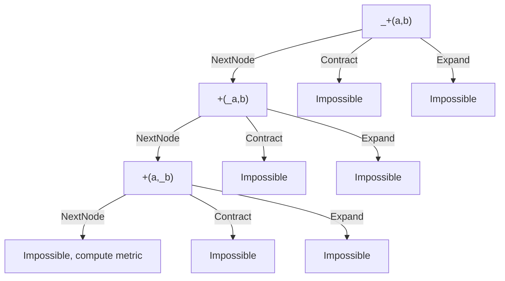
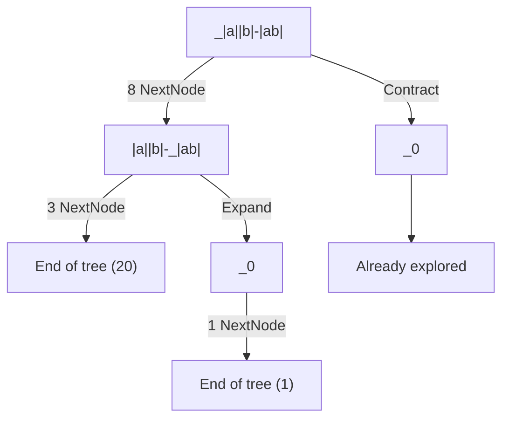

# Simplification algorithm

## General view

From a parsed user input expression, the simplification algorithm does:
1. Ensure the expression has a valid dimension (units, matrices, lists ...)
2. Adjust the approximation strategy if the expression's dimension requires it (units)
3. Seed the random nodes
4. Project the expression, approximate depending on the strategy
5. Replace all user symbols with variables
6. Apply systematic reduction
7. Apply Matrix operators
8. Bubble up lists, applying systematic reduction
9. Apply advanced reduction
10. Approximate again, depending on the strategy
12. Beautify expression
13. Beautify variables back to their names

## 1 - Dimension check

Dimension covers units, matrix size, and list size (handled in a different functions in a similar way).

This is done first here so that all following steps can assume the dimension is correct, removing the need for many checks.

Some issues such as Unreal, division by zero or other undefinitions can still arise later.

## 2 - Approximation strategy

Most units (except angle ones) enforce an approximation of the expression.

To ensure a constant context, we simply raise until the approximation strategy is downgraded to one that approximates everything.

## 3 - Random nodes seeding

Since the next steps may duplicate parts of the expression, we need to seed each random node. a duplicated random node should evaluate to the same random number.

For example, with this projection, both random should never approximate to a different value.
$$sinh(random())=\frac{e^{random()}-e^{-random()}}{2}$$

Therefore, we seed each random in this step with an id. On approximation, random nodes with a same id will be approximated to the same value.

## 4 - Projection

It's expected to:
- Reduce the number of equivalent representations of an expression (Div(A,B) -> Mult(A, Pow(B, -1)))
- Un-contextualize the expression (remove unit, complex format and angle units considerations from reduction algorithm)
- Do nothing if applied a second time

### Effects

| Match | Replace |
|---|---|
| unit | 1 |
| Decimal<b>(A) | 10^(-n)×A |
| cos(A) | trig(A × RadToAngleUnit, 0) |
| sin(A) | trig(A × RadToAngleUnit, 1) |
| tan(A) | tanRad(A × RadToAngleUnit) |
| acos(A) | atrig(A, 0) × RadToAngleUnit |
| asin(A) | atrig(A, 1) × RadToAngleUnit |
| atan(A) | atanRad(A) × RadToAngleUnit |
| sqrt(A) | A^0.5 |
| e^A | exp(A) |
| A^B (with A matrix) | powerMatrix(A, B) |
| A^B (with real complex format) | powerReal(A, B) |
| ceil(A) | -floor(-A) |
| frac(A) | A - floor(A) |
| e | exp(1) |
| conj(A) | re(A)-i×re(A) |
| i | complex(0,1) |
| - A | (-1)×A |
| A - B | A + (-1)×B |
| A / B | A × B^-1 |
| log(A, e) | ln(e) |
| log(A) | ln(A) × ln(10)^(-1) |
| log(A, B) | ln(A) × ln(B)^(-1) |

## 5 - User symbols

TODO

## 6 - Systematic reduction

It's expected to:
- Be efficient and simple
- Apply obvious and definitive changes
- Do nothing if applied a second time

### Effects

| Match | Replace |
|---|---|
| A+(B+C) | A+B+C |
| A×(B×C) | A×B×C |
| A+Dep(B, C) | Dep(A+B, C) |
| 1^x | 1 |
| 0^B (with B > 0) | 0 |
| A^B (with B not an integer) | exp(B×ln(A)) |
| A^0 (with A != 0) | 1 |
| A^1 | A |
| (0 + A×i)^n | ±(A^n) or (0±(A^n)×i) |
| (w^p)^n | w^(p×n) |
| (w1×...×wk)^n | w1^n × ... × wk^n |
| exp(a)^b | exp(a×b) |
| +(A) | A |
| +() | 0 |
| B + A | A + B |
| 0 + A + B | A + B |
| 2 + 4.1 | 6.1 |
| 2 × a + 4.1 × a | 6.1 × a |
| complex(A, B) + complex(C, D) | complex((A + C), (B + D)) |
| ×(A) | A |
| ×() | 1 |
| B × A | A × B |
| 2 × 4.1 | 8.2 |
| 0 × A | 0 |
| 1 × A × B | A × B |
| t^m × t^n | t^(m+n) |
| complex(A, B)×complex(C, D) | complex(AC - BD, AD + BC) |
| powerReal(A, B) (with A complex or positive, or B integer) | A^B |
| powerReal(A, B) (with A negative, B negative rational p/q, q even) | unreal |
| powerReal(A, B) (with A negative, B rational p/q, q odd) | ±|A|^B |
| abs(abs(y)) | abs(x) |
| abs(complex(x, y)) | √(x^2+y^2) |
| abs(x) | ±x |
| trigDiff({1,1,0,0}, {1,0,1,0}) | {0, 1, 3, 0} |
| trig(-x,y) | ±trig(-x,y) |
| trig(πn/120, B) (with some values of n) | exact value |
| trig(atrig(A,B), B) | A |
| trig(atrig(A,B), C) | sqrt(1-A^2) |
| atrig(trig(π*y, i), j) | π/2 - atrig(trig(π*y, i), i) |
| atrig(trig(π*y, 0), 0) (with ⌊y + π/2⌋ even) | π*(y - ⌊y + π/2⌋) |
| atrig(trig(π*y, 0), 0) (with ⌊y + π/2⌋ odd) | π*(⌊y + π/2⌋ - y) |
| atrig(trig(π*y, 1), 1) (with ⌊y⌋ even) | π*(y - ⌊y⌋) |
| atrig(trig(π*y, 1), 1) (with ⌊y⌋ odd) | π*(y - ⌊y⌋ + 1) |
| atrig(A,B) (with A one of the exact values) | exact value |
| arcsin(-x) | -arcsin(x) |
| arccos(-x) | π - arccos(x) |
| D(f(g0(x), g1(x), ...)) (With Di the partial derivative of f on parameter i) | Sum(D(gi(x))*Di(f)(g0(x), g1(x), ...)) |
| Di(x0 * x1 * ... * xi * ...) | x0 * x1 * ... * xi-1 * xi+1 * ... |
| Di(x0 + x1 + ... + xi + ...) | 1 |
| D0(exp(x)) | exp(x) |
| D0(ln(x)) | 1/x |
| D0(Trig(x, n)) | Trig(x, n - 1) |
| D1(Trig(x, n)) | 0 |
| D0(x^n) | n*x^(n - 1) |
| D1(x^n) | 0 |
| ln(exp(x)) | x |
| ln(-1) | iπ |
| ln(0) | undef |
| ln(1) | 0 |
| exp(ln(x)) | x |
| exp(0) | 1 |
| exp(B×ln(A)) (with B an integer) | A^B |
| complex(A, 0) | A |
| complex(re(x), im(x)) | x |
| complex(x, y) (with x or y non real) | complex(re(x) - im(y), im(x) + re(y)) |
| arg(0) | undef |
| arg(x) with x positive | 0 |
| arg(x) with x negative | π |
| im(complex(x, y)) | y |
| im(x) (with x real) | 0 |
| im(x + y) | im(x) + im(z) |
| re(complex(x, y)) | x |
| re(x) (with x real) | x |
| re(x + y) | re(x) + re(z) |
| sum(k, k, m, n) | n(n + 1)/2 - (m - 1)m/2 |
| sum(k^2, k, m, n) | n(n + 1)(2n + 1)/6 - (m - 1)(m)(2m - 1)/6 |
| sum(f, k, m, n) (with f independent of k or random nodes) | (1 + n - m)*f |
| prod(f, k, m, n) (with f independent of k or random nodes) | f^(1 + n - m) |
| gcd(B, gcd(C, A)) | gcd(A, B, C) |
| lcm(B, lcm(C, A)) | lcm(A, B, C) |
| gcd(A) | A |
| lcm(A) | A |
| gcd(A, B) (with A, B integers) | exact value if A, B integers, undef otherwise |
| lcm(A, B) (with A, B integers) | exact value if A, B integers, undef otherwise |
| rem(A, 0) | undef |
| quo(A, 0) | undef |
| rem(A, B) (with A, B integers) | exact value |
| quo(A, B) (with A, B integers) | exact value |
| A! (with A positive integer) | Prod(k, 1, A, k) |
| binomial(n,k) (with valid n, k) | (n - 0)/(k - 0)*...*(n - j)/(k - j)*...*(n - k - 1)/(k - k + 1) |
| permute(n, k) (with valid n, k) | n!/(n-k)! |
| sign(A) | 0 / 1 / -1 if A sign is known |
| ⌊A⌋ (with A rational) | exact value |
| round(A, B) (with valid A, B) | floor(A * 10^B + 1/2) * 10^-B |
| listSort(L) | Apply sort |
| median(L) | result |
| dim(A) | result |
| L(n) | result |
| mean(L) | result |
| stddev(L) | result |
| variance(L) | result |
| sampleStdDev(L) | result |
| minimum(L) | result |
| maximum(L) | result |
| sum(L) | result |
| prod(L) | result |

## 7 - Matrix operators

TODO

## 8 - Matrix operators

TODO

## 9 - Advanced Reduction

It's expected to:
- Reduce any reducible expression if given enough ressources
- Do its best with reduced ressources
- Be deterministic

### Effects

| Match | Replace |
|---|---|
| A?×\|B\|×\|C\|×D? | A×\|BC\|×D |
| \|A×B?\| | \|A\|×\|B\| |
| exp(A + iB) | exp(A)×(cos(B) + i×sin(B)) |
| exp(A + B?) | exp(A) × exp(B) |
| A? × exp(B) × exp(C) × D? | A × exp(B + C) × D |
| A?×(B + C?)×D? | A×B×D + A×C×D |
| A? + B?×C×D? + E? + F?×C×G? + H? | A + C×(B×D + F×G) + E + H |
| (A + B×i)^2 | (A^2 - 2×B^2 + 2×A×B×i) |
| (A? + B)^2 | (A^2 + 2×A×B + B^2) |
| A×ln(B) (with A integer) | ln(B^A) |
|A? + ln(B) + C? + ln(D) + E? | A + C + ln(BD) + E |
| ln(12/7) | 2×ln(2) + ln(3) - ln(7) |
| ln(A×B?) | ln(A) + ln(B) |
| ln(A^B) | B×ln(A) |
| A? + cos(B)^2 + C? + sin(D)^2 + E? | 1 + A + C + E |
| A?×Trig(B, C)×D?×Trig(E, F)×G? | 0.5×A×D×(Trig(B - E, TrigDiff(C, F)) + Trig(B + E, C + F))×G |
| Trig(A? + B, C) | Trig(A, 0)×Trig(B, C) + Trig(A, 1)×Trig(B, C-1) |
| sum(f + g, k, a, b) | sum(f, k, a, b) + sum(g, k, a, b) |
| sum(x_k, k, 0, n) | x_0 + ... + x_n |
| prod(f×g, k, a, b) | prod(f, k, a, b) × prod(g, k, a, b) |
| prod(x_k, k, 0, n) | x_0 × ... × x_n |
| Prod(u(k), k, a, b) / Prod(u(k), k, a, c) (with c < b) | Prod(u(k), k, c+1, b) |
| binomial(n, k) | n! / (k!(n - k)!) |
| permute(n, k) | n! / (n - k)! |
| tan(A) | sin(A) / cos(A) |
| atan(A) | asin(A / Sqrt(1 + A^2)) |

### Examples

Unsuccessful advanced reduction on simple tree $a+b$.

`_` represent the node that is being examined.

Successful advanced reduction on $|a||b|-|ab|=0$.

For clarity, Impossible paths are removed and nextNode are concatenated.

Successful advanced reduction on
$$-a^2-b^2+(a+b)^2+a(c+d)^2=a(2b+(c+d)^2)$$
NextNode explorations are hidden for clarity.

```mermaid
graph TD;
  Root["-a^2-b^2+(a+b)^2+a(c+d)^2"]-->X1["36 VS 36"]
  Root-->|Expand|A["-a^2-b^2+(a+b)^2+a(c^2+2cd+d^2)"]
    A-->X2["45 VS 36"]
    A-->|Expand|AA["-a^2-b^2+(a+b)^2+ac^2+a(2cd+d^2)"]
      AA-->X3["49 VS 36"]
      AA-->|Expand|AAA["-a^2-b^2+(a+b)^2+ac^2+2acd+ad^2"]
        AAA-->X4["49 VS 36"]
        AAA-->|Expand|AAAA["2ab+ac^2+2acd+ad^2"]
          AAAA-->X5["Full path, 34 VS 36"]
        AAA-->|Contract|AAAB["(a+b)^2-(a^2+b^2)+ac^2+2acd+ad^2"]
          AAAB-->X6["Full path, 48 VS 34"]
          AAAB-->|Contract|AAABA["(a+b)^2-(a^2+b^2)+ad^2+a(c^2+2cd)"]
            AAABA-->X7["Full path, 48 VS 34"]
      AA-->|Expand|AAB["2ab+ac^2+a(2cd+d^2)"]
        AAB-->X8["34 VS 34"]
        AAB-->|Contract|AABA["a(2b+c^2)+a(2cd+d^2)"]
          AABA-->X9["Full path, 34 VS 34"]
          AABA-->|Contract|AABAA["a(2b+c^2+2cd+d^2)"]
            AABAA-->X10["Full path, 26 VS 34"]
      AA-->|Contract|AAC["(a+b)^2-(a^2+b^2)+ac^2+a(2cd+d^2)"]
        AAC-->X11["48 VS 26"]
        AAC-->|Expand|AACA["a^2+2ab+b^2-(a^2+b^2)+ac^2+a(2cd+d^2)"]
          AACA-->X12["Full path, 55 VS 26"]
          AACA-->|Contract|AACAA["a^2+b^2-(a^2+b^2)+a(2b+c^2)+a(2cd+d^2)"]
            AACAA-->X13["Full path, 55 VS 26"]
        AAC-->|Contract|AACB["(a+b)^2-(a^2+b^2)+a(c^2+2cd+d^2)"]
          AACB-->X14["44 VS 26"]
          AACB-->|Expand|AACBA["a^2+2ab+b^2-(a^2+b^2)+a(c^2+2cd+d^2)"]
            AACBA-->X15["Full path, 51 VS 26"]
    A-->|Expand|AB["2ab+a(c^2+2cd+d^2)"]
      AB-->X16["30 VS 26"]
      AB-->|Contract|ABA["a(2b+c^2+2cd+d^2)"]
        ABA-->X17["26 VS 26"]
        ABA-->|Contract|ABAA["a(c^2+d^2+2(b+cd))"]
          ABAA-->X18["Full path, 27 VS 26"]
          ABAA-->|Expand|ABAAA["ac^2+a(d^2+2(b+cd))"]
            ABAAA-->X19["Full path, 33 VS 26"]
    A-->|Contract|AC["(a+b)^2-(a^2+b^2)+a(c^2+2cd+d^2)"]
      AC-->X20["44 VS 26"]
      AC-->|Expand|ACA["a^2+2ab+b^2-(a^2+b^2)+a(c^2+2cd+d^2)"]
        ACA-->X21["51 VS 26"]
        ACA-->|Contract|ACAA["a^2+b^2-(a^2+b^2)+a(2b+c^2+2cd+d^2)"]
          ACAA-->X22["49 VS 26"]
          ACAA-->|Contract|ACAAA["a^2+b^2-(a^2+b^2)+a(c^2+d^2+2(b+cd))"]
            ACAAA-->X23["Full path, 50 VS 26"]
  Root-->|Expand|B["2ab+a(c+d)^2"]
    B-->X24["21 VS 26"]
    B-->|Contract|BA["a(2b+(c+d)^2)"]
      BA-->X25["19 VS 21"]
  Root-->|Contract|C["(a+b)^2-(a^2+b^2)+a(c+d)^2"]
    C-->X26["35 VS 19"]
    C-->|Expand|CA["a^2+2ab+b^2-(a^2+b^2)+a(c+d)^2"]
      CA-->X27["42 VS 19"]
      CA-->|Contract|CAA["a^2+b^2-(a^2+b^2)+a(2b+(c+d)^2)"]
        CAA-->X28["42 VS 19"]
```

